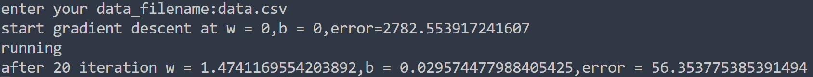
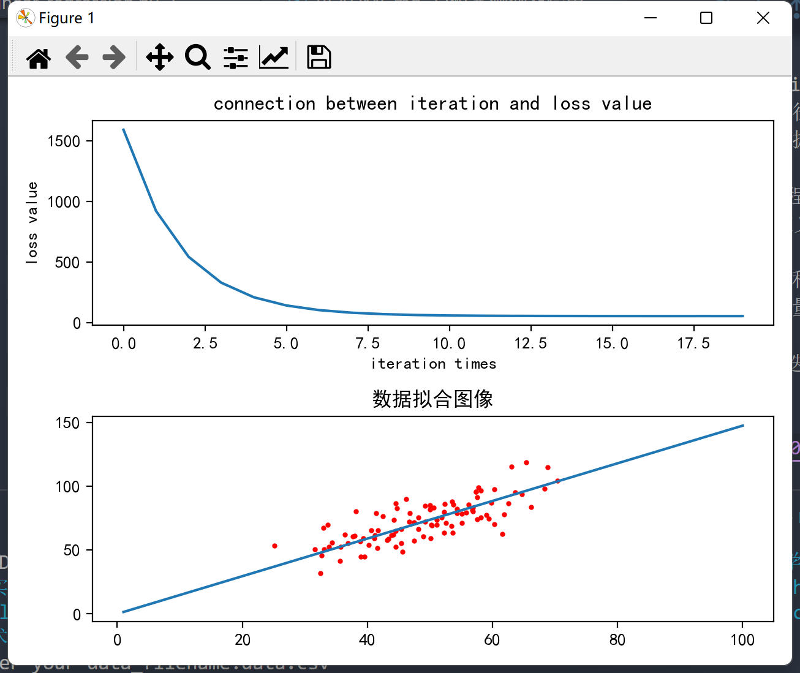
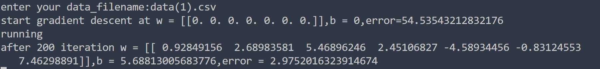
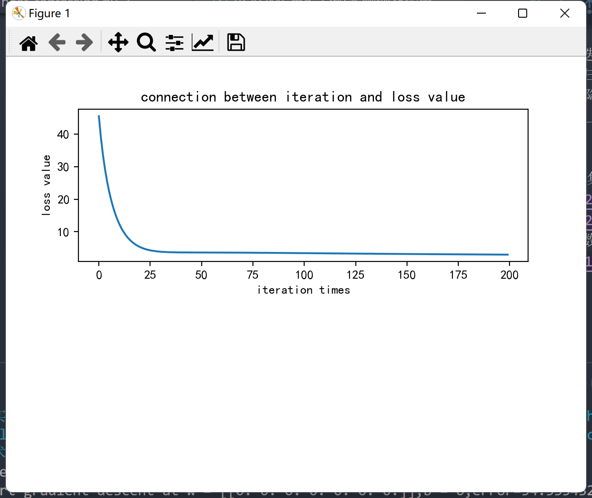

# Introduction

该程序实现简单的线性回归，即给出一系列点，求出能够对数据拟合的直线方程，本程序采用最大似然的方法实现数据的拟合；

# 运行环境及相关配置

python 3.9.7
numpy库以及matplotlib库的安装，前者支持各种向量操作，后者支持绘图以及函数的可视化；

# 程序思路

1. 设拟合的直线方程为y = w * x + b；
2. 基于最大似然法的损失函数值loss = 1/(2*m)[y - (w * x + b)]^2；
3. 通过对损失函数对w和b求导，计算梯度；
4. 该程序使用RMSProp方法更新w和b的值，使用梯度平方的指数加权平均累积生成梯度下降的系数值，可以使得不同模型下梯度下降的速度由学习率和当前梯度共同决定，避免了更新过慢或学习率过大无法到达最小值的问题；
5. 通过有限次迭代采用梯度下降法得到最终的w和b的值；
6. 最后绘制图像表示损失函数的变化以及直线方程对数据的拟合情况；

# 代码内容简介

1. loss函数用于计算当前w和b的情况下损失函数值；
2. step_gradient函数计算单次迭代梯度下降后得到的w和b的值；
3. grad_run函数计算有限次迭代最后的w和b的值以及每次迭代的损失函数值，并绘制损失函数值的变化图像；
4. 主函数中导入数据，设置学习率，迭代次数，以及初始的w和b的值，迭代前输出初始的w，b，以及损失函数值，通过迭代后输出w，b和损失函数值，最后输出拟合直线方程;

# 运行输入输出

点击运行后，终端会显示“enter your data_filename:”，在此输入文件名即可，若与程序不在同一个目录下记得按相对路径输入文件名；
最终会输出损失函数值的变化以及直线方程对数据的你和情况；

# 注意事项

1. 本程序可实现简单的一元线性回归的可视化以及多元线性回归的计算，由于多元线性回归难以可视化以及可视化的泛化困难性，因此仅对一元线性回归进行可视化；
2. 学习率和迭代次数在本程序中默认为0.01和200，而梯度下降法中的超参数动量因子β默认为0.9，在一元线性回归和多元线性回归中已经可以达到不错的拟合效果；
3. 迭代的次数也可以改为损失函数阈值来限定迭代次数；
4. 本程序主要是为了证明该程序在一元线性回归和多元线性回归中都可以运行，且效果较好，因此增加了RMSProp的梯度下降法，使得模型得以泛化而不用频繁调整学习率或迭代次数，减少人力，实际上实现普通的线性回归没有必要使用RMSProp方法进行梯度下降；

# 测例及输出

1. 本程序使用一元线性回归的data.csv的数据集，程序输出如下：
   
   
2. 本程序使用一元线性回归的data(1).csv的数据集，该数据集是为了验证鲍鱼年龄和其各种特征之间的关系，程序输出如下：
   
   
